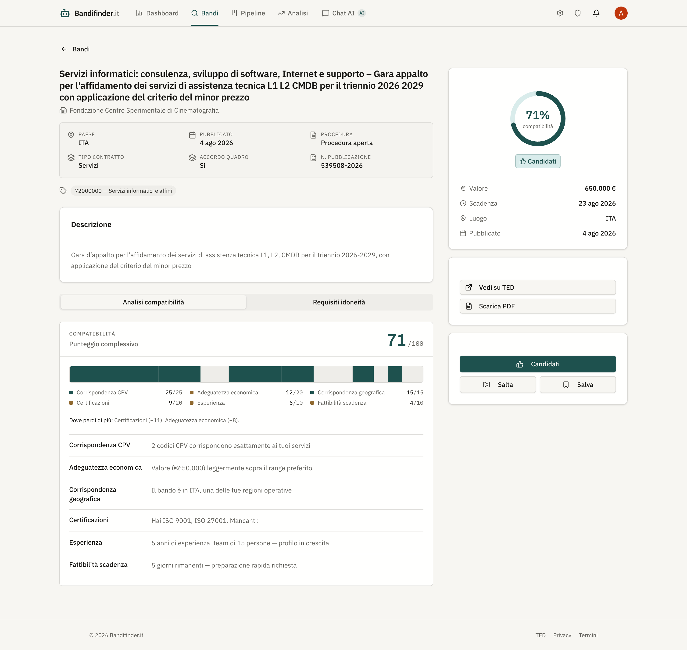
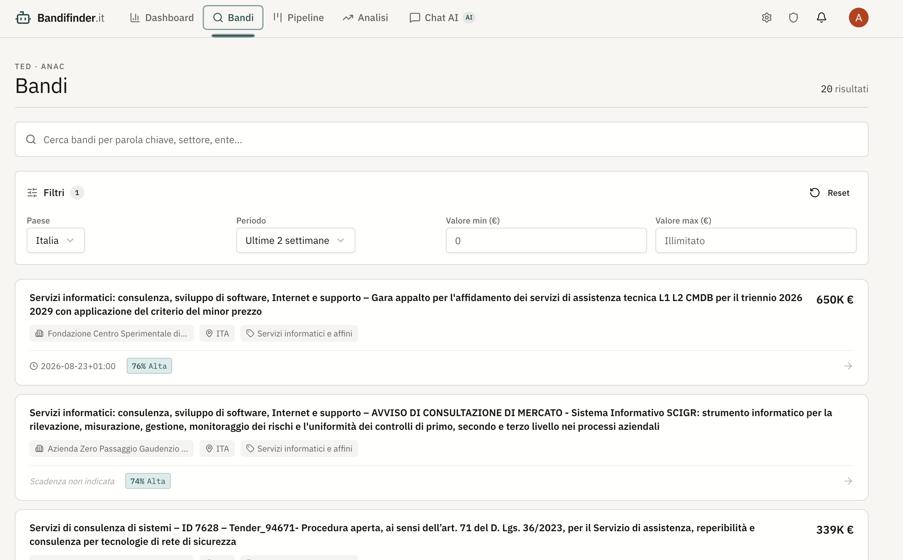
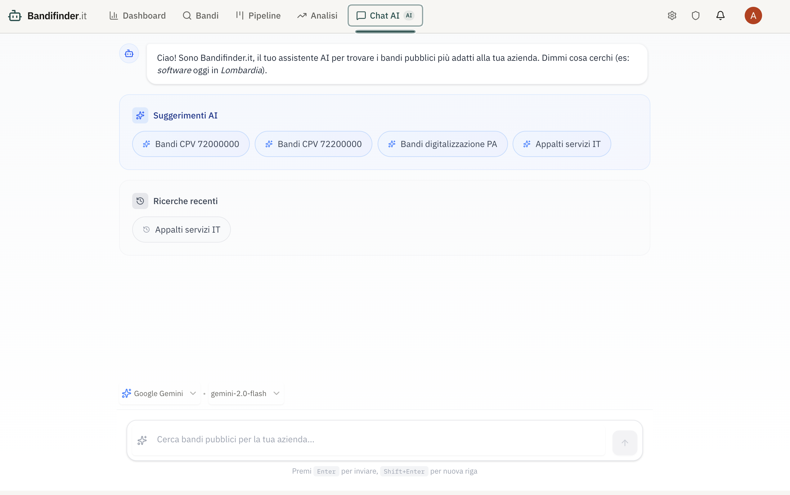
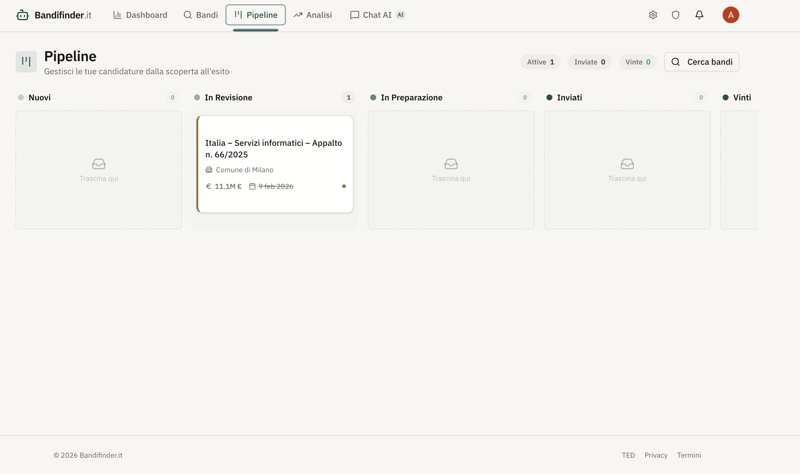
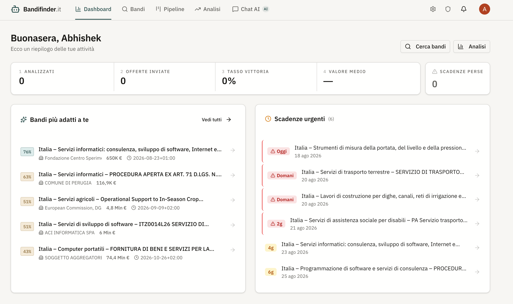

# Bandifinder.it

> **AI-Powered Public Tender Discovery & Bid Management Platform**

Bandifinder.it helps Italian businesses discover, analyze, and bid on public tenders across Italy and the EU. It combines a deterministic, explainable scoring engine with multi-agent AI and structured data pipelines — from discovery to post-mortem analytics.



> Every score is shown as the sum of its parts. Each segment of the meter is as
> wide as that component is worth (CPV 25, certifications 20, economic fit 20,
> geography 15, experience 10, deadline 10), and filled to what was earned — so
> the gaps show exactly where the points went, sized by how much they mattered.

## Features

### Tender Discovery
- Natural language search via AI chat agent
- TED API v3 + ANAC integration, ingested every 6h via Supabase `pg_cron`
- Filters (country, period, value range), full-text search, paginated results
- Semantic vector search (Pinecone) + GraphRAG hybrid retrieval
- Country filter defaults to Italy; widening to the EU is one click





### Explainable Scoring Engine
- 6 weighted components out of 100: CPV match (25), certifications (20), economic fit (20), geography (15), experience (10), deadline feasibility (10)
- Deterministic — **no LLM involved**, so every score is reproducible and defensible
- Per-component explanations in Italian, plus a pass/fail eligibility checklist
- BID (≥70) / REVIEW (40–69) / SKIP (<40) recommendations
- Scores cached per-org with a 24h TTL
- The same engine backs the REST API *and* the chat agent, so the two can never disagree

### Guest Mode
- Visitors browse tenders and see **real fit scores** without creating an account
- A short inline form (sector, regions, certifications, revenue) feeds the scoring engine
- The profile lives in `localStorage` and travels as a request header; nothing is persisted server-side
- A guest carries no user id and no organization, so guest requests can never reach another org's data
- Saving bids, favourites and exports prompt for signup

### Bid Pipeline (Kanban)
- 6 stages: Nuovi → In Revisione → In Preparazione → Inviati → Vinti / Persi
- Drag-and-drop (dnd-kit) + hover move buttons
- Checklist items, threaded comments, team assignments
- Auto-generated compliance checklist on bid creation



> Pipeline stages darken along a single teal ramp, so how far a bid has
> travelled is legible from colour alone. Only the terminal states break it.

### Post-Mortem Analytics
- Win/loss tracking with competitive intelligence
- Win rate segmented by value range and buyer
- Competitor analysis (direct bid outcomes + TED award data)
- Lessons learned feed



> The four headline figures are one funnel — analysed, submitted, won, average
> value — so they read in order. Missed deadlines is a different kind of number
> and gets its own card, turning vermilion the moment it is non-zero.

### Multi-Source Ingestion
- Modular connector system (TED API v3, ANAC CSV, TED Awards)
- Deduplication with amendment detection (8-field comparison)
- Automatic notification generation for saved searches
- Scheduled by Supabase `pg_cron`; admin manual trigger available

### Billing & Usage Limits
- Stripe integration with 4 tiers (Free / Starter / Pro / Enterprise)
- Daily search quotas and rate limits held in Postgres, so they are shared across
  all serverless instances and survive restarts
- Quota consumption is a single atomic statement — concurrent requests cannot overshoot a limit
- Checkout, customer portal, webhook-driven plan sync

### Other
- Clerk authentication (JWT, organizations, RBAC), verified server-side on every protected route
- GDPR cookie consent banner (controls Sentry replay + Vercel Analytics)
- Sentry error tracking (frontend + API)
- Guided onboarding flow (org creation → profile completion)
- Full Italian UI

## Architecture

```
┌─────────────────────────────────────────────────────┐
│  Next.js 16 Frontend (Vercel)                       │
│  React 19 · Clerk Auth · ShadCN UI · TanStack Query │
│  dnd-kit · Sentry · Vercel Analytics                │
└──────────────────────┬──────────────────────────────┘
                       │ REST + SSE
┌──────────────────────▼──────────────────────────────┐
│  Hono.js API (Vercel Serverless)                    │
│  LangGraph Supervisor → 5 Specialized Agents        │
│  Scoring Engine · Ingestion Pipeline · Stripe       │
│  Security Middleware (auth, rate limit, PII)        │
│  Observability (metrics, logging, tracing, Sentry)  │
└───┬──────────┬──────────┬──────────┬────────────────┘
    │          │          │          │
 Supabase   Pinecone   TED API   Stripe
 Postgres   Vectors    + ANAC    Billing
```

### Authentication model

| Route group | Access |
|---|---|
| `/tenders/*`, `/analytics/*`, `/compare/*` | Signed-in **or** guest |
| `/agent/*`, `/suggestions/*` | Optional auth (public chat) |
| `/company`, `/bids`, `/billing`, `/preferences`, `/notifications`, `/saved-searches`, `/organizations`, `/export` | Verified Clerk session required |
| `/ingestion/*` | Admin session **or** `Authorization: Bearer $CRON_SECRET` |
| `/webhooks/*` | Signature-verified (Clerk via Svix, Stripe) |

Identity comes only from a verified Clerk JWT. Guests get a separate context that
carries no user id and no organization id.

### AI Multi-Agent System

A **router** pattern: classify intent, route to one specialist, format the result.

| Agent | Role |
|-------|------|
| Supervisor | Keyword intent classification and routing |
| Search | TED API queries and tender discovery |
| Analysis | Eligibility and scoring — delegates to the scoring engine |
| Ranking | Ordering and shortlisting — delegates to the scoring engine |
| Personalization | Profile-based recommendations |
| Contract Review | Risk analysis and clause extraction |
| General | Product questions and greetings (no tools) |

Agent identity comes from the graph config (`configurable.user_id`), never from
the model. Conversation threads are checkpointed to Postgres when `DATABASE_URL`
is set, falling back to in-memory otherwise.

## Getting Started

### Prerequisites
- Node.js 22+ (the deployed API targets Node 24)
- npm

### Installation

```bash
npm install            # frontend
cd backend && npm install  # API
```

### Environment Variables

**Root `.env` / `.env.local`:**
```env
NEXT_PUBLIC_CLERK_PUBLISHABLE_KEY=pk_...
CLERK_SECRET_KEY=sk_...
NEXT_PUBLIC_TENDER_API_BASE=http://localhost:3001   # API base URL
NEXT_PUBLIC_SENTRY_DSN=https://...
SENTRY_AUTH_TOKEN=sntrys_...
SENTRY_ORG=your-org
SENTRY_PROJECT=your-project
```

**`backend/.env.local`:**
```env
OPENROUTER_API_KEY=sk-or-v1-...
OPENAI_API_KEY=sk-...            # embeddings for Pinecone
PINECONE_API_KEY=pcsk_...
SUPABASE_URL=https://....supabase.co
SUPABASE_SERVICE_ROLE_KEY=eyJ...
DATABASE_URL=postgresql://...    # Postgres connection string (use the pooler)
CLERK_SECRET_KEY=sk_...
CLERK_WEBHOOK_SECRET=whsec_...
STRIPE_SECRET_KEY=sk_...
STRIPE_WEBHOOK_SECRET=whsec_...
STRIPE_PRICE_STARTER=price_...
STRIPE_PRICE_PRO=price_...
STRIPE_PRICE_ENTERPRISE=price_...
FRONTEND_URL=http://localhost:3000
SENTRY_DSN=https://...
CRON_SECRET=...                  # shared secret for scheduled ingestion
```

Optional, local development only:

| Variable | Purpose |
|---|---|
| `PORT` | API port (default 3001) |
| `CORS_EXTRA_ORIGINS` | Comma-separated extra origins, e.g. when port 3000 is taken |
| `ALLOW_INSECURE_HEADER_AUTH` | Set to `true` to accept an unverified `x-user-id` header. **Never set this in a deployed environment** — it is a complete authentication bypass |
| `LOG_LEVEL` | `debug` \| `info` \| `warn` \| `error` |

> `DATABASE_URL` is a **Postgres connection string**, not `SUPABASE_URL` (which is
> the REST endpoint). Use Supabase's pooler URL — direct connections exhaust
> Postgres connection limits from serverless.

### Database

Apply the migrations in `supabase/migrations/` in order. Then schedule the
housekeeping job:

```sql
select cron.schedule('purge-usage', '17 3 * * *', 'select purge_usage_data()');
```

### Development

```bash
# Terminal 1 — Frontend (http://localhost:3000)
npm run dev

# Terminal 2 — API (http://localhost:3001)
cd backend && npm run dev
```

### Testing

```bash
cd backend && npm test
```

262 tests covering the scoring engine, auth enforcement, guest access, usage
limits, agent tools, and GraphRAG isolation. The SQL in migration 006 is
executed against a real Postgres via PGlite rather than mocked.

## Project Structure

```
Tender-Finder-AI/
├── app/                              # Next.js App Router
│   ├── page.tsx                      # AI Chat interface
│   ├── dashboard/                    # KPIs, high-fit tenders, deadlines
│   ├── tenders/                      # Search, filters, table
│   │   └── [id]/                     # Detail, scoring, eligibility
│   ├── pipeline/                     # Kanban board (dnd-kit)
│   ├── bids/[id]/                    # Bid detail, checklist, comments
│   ├── analytics/                    # Win/loss, competitors, lessons
│   ├── onboarding/                   # Org creation + profile wizard
│   ├── settings/                     # Profile, notifications, billing, team
│   └── admin/                        # Platform metrics + ingestion control
├── components/
│   ├── ui/                           # ShadCN primitives
│   ├── tender/                       # ScoreMeter, FitScoreBadge, DeadlineCountdown
│   ├── guest/                        # GuestBanner, GuestProfileDialog
│   ├── notifications/                # Bell, drawer, items
│   ├── onboarding/                   # Stepper, completeness bar
│   ├── Header.tsx                    # Navigation
│   ├── OnboardingGate.tsx            # Global onboarding enforcement
│   └── CookieConsent.tsx             # GDPR banner
├── lib/
│   ├── hooks/                        # useApiQuery, useBids, useBilling, etc.
│   ├── utils/                        # Formatters (EUR, dates, urgency)
│   ├── guestSession.ts               # Guest id + profile (localStorage)
│   └── cookieConsent.ts              # Consent utility
├── backend/src/                      # Hono.js API
│   ├── app.ts                        # Route mounting + middleware
│   ├── server.ts                     # Local dev server
│   ├── loadEnv.ts                    # Env loading, imported before the app
│   ├── agents/                       # LangGraph supervisor + agents + tools
│   ├── routes/                       # tenders, bids, billing, analytics, …
│   ├── lib/
│   │   ├── db/                       # Supabase query layers
│   │   ├── scoring/                  # 6-component engine + compliance
│   │   ├── ingestion/                # TED, ANAC, Award connectors + runner
│   │   ├── graphrag/                 # Knowledge graph + hybrid retrieval
│   │   ├── guest.ts                  # Guest profile parsing + scoring adapter
│   │   ├── scoringContext.ts         # Resolves the profile to score against
│   │   ├── checkpointer.ts           # LangGraph Postgres checkpointer
│   │   └── observability/            # Metrics, logging, tracing
│   ├── middleware/                   # auth, guest, rate limit, billing, PII
│   ├── __tests__/                    # Vitest suites (incl. PGlite SQL tests)
│   └── build.mjs                     # esbuild → Vercel Build Output API
├── supabase/migrations/
│   ├── 001_initial_schema.sql        # Core tables
│   ├── 002_tender_scores.sql         # Score cache
│   ├── 003_bid_pipeline.sql          # Bids, assignments, comments, checklist
│   ├── 004_bid_outcomes.sql          # Post-mortem outcomes
│   ├── 005_tender_awards.sql         # Award data fields
│   └── 006_usage_limits.sql          # Quota + rate limit counters
└── vercel.json                       # Rewrites + CORS headers
```

## Design System

The interface is built around procurement as a precision instrument.

- **Type** — Archivo (display), IBM Plex Sans (interface), IBM Plex Mono (CPV codes, protocol numbers, figures)
- **Palette** — warm paper ground, deep teal primary (`Verderame`), brass for caution, graphite for inert
- **One rule** — vermilion means *"time is running out"* and nothing else. A poor fit is graphite, never red, which is what makes an approaching deadline actually register
- **Score meter** — segment widths are proportional to each component's maximum, so the bar shows both what you scored and how much each dimension counts

## Tech Stack

| Category | Technology |
|----------|------------|
| Frontend | Next.js 16, React 19, Tailwind CSS 4, TypeScript 6 |
| UI | ShadCN UI, Radix UI |
| State | TanStack Query, dnd-kit |
| Auth | Clerk v7 (JWT, orgs, RBAC) |
| Backend | Hono.js on Vercel Serverless, TypeScript 7 |
| AI | LangGraph 1.4, LangChain, OpenRouter |
| Database | Supabase Postgres |
| Vectors | Pinecone |
| Billing | Stripe |
| Testing | Vitest, PGlite |
| Monitoring | Sentry, Vercel Analytics |
| Deployment | Vercel |

## API Endpoints

### Tenders
| Method | Endpoint | Description | Guest |
|--------|----------|-------------|:---:|
| GET | `/tenders` | List tenders | ✅ |
| GET | `/tenders/search` | Search with filters + fit scores | ✅ |
| GET | `/tenders/best` | Best matches for the profile | ✅ |
| GET | `/tenders/:id` | Tender detail | ✅ |
| GET | `/tenders/:id/analysis` | Scoring + eligibility | ✅ |
| POST | `/tenders/semantic` | Vector search | ✅ |
| POST | `/tenders/graphrag` | Hybrid graph retrieval | ✅ |
| POST | `/tenders/favorite` | Toggle favorite | ❌ |

### Bids
| Method | Endpoint | Description |
|--------|----------|-------------|
| GET | `/bids` | List bids (with status filter) |
| POST | `/bids` | Create bid from tender |
| PATCH | `/bids/:id` | Update bid (status, priority) |
| GET/POST | `/bids/:id/outcome` | Record bid outcome |
| GET/POST | `/bids/:id/comments` | Threaded comments |
| GET/PATCH | `/bids/:id/checklist` | Compliance checklist |

### Analytics
| Method | Endpoint | Description |
|--------|----------|-------------|
| GET | `/analytics/outcomes` | Win/loss stats, segments, competitors |
| GET | `/analytics/kpis` | Dashboard KPIs |
| GET | `/analytics/market-competitors` | TED award-based competitors |

### Billing
| Method | Endpoint | Description |
|--------|----------|-------------|
| GET | `/billing` | Current plan |
| GET | `/billing/plans` | Available plans |
| POST | `/billing/checkout` | Stripe checkout session |
| POST | `/billing/portal` | Stripe customer portal |

### Other
| Method | Endpoint | Description |
|--------|----------|-------------|
| POST | `/agent/stream` | AI chat (SSE) |
| GET/POST | `/company` | Company profile |
| POST | `/ingestion/run` | Trigger ingestion (admin or cron secret) |
| POST | `/webhooks/clerk` | Clerk webhook |
| POST | `/webhooks/stripe` | Stripe webhook |
| GET | `/health` · `/metrics` | Health and metrics |

## Deployment

Both projects deploy to Vercel from this repository, and **both watch `main`** —
a single push triggers two production deployments.

| Project | Root | Notes |
|---|---|---|
| Frontend | repo root | Next.js preset |
| API | `backend/` | `framework: null` — `build.mjs` emits a Build Output API bundle, so no framework preset should build on top of it |

Before deploying the API, confirm:

1. `CRON_SECRET` is set, and the `pg_cron` ingestion jobs send it as `Authorization: Bearer …`
2. `DATABASE_URL` is set to the Postgres pooler URL
3. Migrations through `006` are applied
4. `CLERK_SECRET_KEY` and `SUPABASE_URL` exist in **Preview** as well as Production, or preview deployments will reject every authenticated request

## License

MIT License — see [LICENSE](LICENSE).

---

**Built for the Italian and EU public procurement community**
